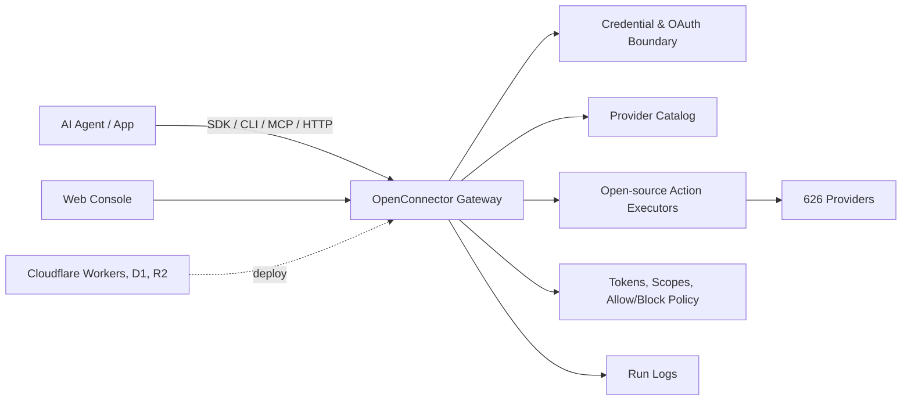

# OpenConnector

[English](README.md) | [简体中文](README.zh-CN.md)

[](LICENSE.txt)


OpenConnector is an open-source auth gateway that connects 626 providers, supports
Cloudflare-compatible deployment, and provides 6,552 prebuilt Actions that AI agents can call
directly through the [Connector SDK](https://github.com/oomol-lab/connector-sdk),
[oo CLI](https://github.com/oomol-lab/oo-cli), MCP, and HTTP.

OpenConnector does more than store provider credentials. The gateway, provider catalog, and Action
executors are open source, so developers can self-host the runtime, inspect every Action contract,
and give agents a controlled way to work with real SaaS products without rebuilding each integration
from scratch.

## Why OpenConnector

- [626 providers and 6,552 prebuilt Actions](docs/providers.md) across SaaS products such as
  GitHub, Gmail, Notion, BigQuery, Google Analytics, Supabase, Airtable, Slack, and more.
- Open-source auth gateway for API keys, OAuth2, custom credentials, and no-auth providers.
- Open-source Action layer with prebuilt request/response schemas and lazy-loaded executors.
- Cloudflare-compatible runtime for fast self-hosted deployment on Workers, D1, R2, and Static
  Assets.
- Agent-ready access through the [Connector SDK](https://github.com/oomol-lab/connector-sdk),
  [oo CLI](https://github.com/oomol-lab/oo-cli), MCP, HTTP API, OpenAPI, and a local Web Console.
- Runtime controls for connection identity, scopes, runtime tokens, action allow/block policies,
  temporary file transit, and redacted run logs.

## Developer Tools

| Tool                                                        | Use it for                                                                                                    |
| ----------------------------------------------------------- | ------------------------------------------------------------------------------------------------------------- |
| [Connector SDK](https://github.com/oomol-lab/connector-sdk) | Call connector Actions, proxy upstream APIs, and inspect the catalog from TypeScript apps and agent runtimes. |
| [oo CLI](https://github.com/oomol-lab/oo-cli)               | Give local AI agents a command-line entry to discover, inspect, and call connected account capabilities.      |
| MCP                                                         | Expose app Actions to MCP-capable agent hosts through `http://localhost:3000/mcp`.                            |
| HTTP / OpenAPI                                              | Call `/v1/actions/*` directly or inspect the generated `/openapi.json` document.                              |

## Connected SaaS Logo Wall

OpenConnector supports a broad provider catalog. Here is a preview of common SaaS connections.


Provider names and trademarks belong to their respective owners and are used only for identification
and interoperability.

## How It Works



Agents discover Actions, inspect schemas and scopes, select a connection alias, and execute through
the gateway. Provider secrets stay behind the runtime boundary; agents receive only the metadata,
safe account labels, and execution results they need.

## Deployment Paths

| Path                         | Best for                                     | What you get                                                                      |
| ---------------------------- | -------------------------------------------- | --------------------------------------------------------------------------------- |
| OSS self-host                | Developers and teams that want full control  | Local Docker or Node runtime, SQLite storage, MCP, HTTP, OpenAPI, and Web Console |
| Cloudflare-compatible deploy | Teams that want a lightweight hosted runtime | Workers runtime, D1 state, R2 transit files, and Static Assets for the console    |

## Cloudflare Quick Start Video

Coming soon: a YouTube walkthrough for launching a usable OpenConnector deployment on Cloudflare.

## Quick Start

Start the runtime with Docker Compose:

```bash
docker compose up --build
```

Open the local console and generated API reference:

```text
http://localhost:3000
http://localhost:3000/docs
```

Run a no-auth Action to verify the runtime:

```bash
curl -s -X POST http://localhost:3000/v1/actions/hackernews.get_top_stories \
  -H 'content-type: application/json' \
  -d '{"input":{}}'
```

See [docs/quickstart.md](docs/quickstart.md) for the full local setup, first provider connection,
OAuth flow, and runtime settings.

## Connect A Provider

GitHub is the simplest credentialed example because it can use a personal access token:

```bash
curl -s -X PUT http://localhost:3000/api/connections/github \
  -H 'content-type: application/json' \
  -d '{"authType":"api_key","values":{"apiKey":"github_pat_..."}}'

curl -s -X POST http://localhost:3000/v1/actions/github.get_current_user \
  -H 'content-type: application/json' \
  -d '{"input":{}}'
```

For OAuth2 apps, named connections, credential encryption, token refresh, and action policies, see
[docs/credentials.md](docs/credentials.md) and [docs/configuration.md](docs/configuration.md).

## Give Tools To An Agent

OpenConnector exposes the same Action catalog through multiple agent-friendly surfaces:

- MCP: `http://localhost:3000/mcp`
- HTTP runtime API: `/v1/actions`
- OpenAPI document: `/openapi.json`
- Action guides: `/api/actions/:actionId/agent.md`
- Web Console examples: cURL, TypeScript, and agent prompt snippets for each Action

See [docs/runtime-api.md](docs/runtime-api.md) for endpoint details, response envelopes, auth
headers, MCP tools, and Action guide examples.

## Web Console

Open `http://localhost:3000` after starting the runtime. The console helps you browse providers,
save API keys or OAuth client configuration, create runtime tokens, inspect Action schemas, run
Actions for debugging, review recent runs, and open the generated OpenAPI and MCP metadata.

## Cloudflare Deployment

OpenConnector supports Cloudflare Workers as a metadata and runtime-state deployment target using
Workers, D1, R2, and Static Assets.

See [docs/cloudflare.md](docs/cloudflare.md) for resource creation, migrations, secrets, local Worker
preview, and remote deployment.

## Documentation

- [Quickstart](docs/quickstart.md)
- [Developer tools](docs/sdk-cli.md)
- [Provider coverage](docs/providers.md)
- [Runtime API and MCP](docs/runtime-api.md)
- [Cloudflare deployment](docs/cloudflare.md)
- [Configuration](docs/configuration.md)
- [Credentials and OAuth](docs/credentials.md)
- [Catalog format](docs/catalog-format.md)
- [Verification language](docs/verification.md)
- [Contributing](CONTRIBUTING.md)
- [Code of Conduct](CODE_OF_CONDUCT.md)
- [Security](SECURITY.md)

## Development

Use Node.js 22 or newer:

```bash
npm install
npm run build:web
npm run dev
```

Before opening a pull request:

```bash
npm run fix-check
npm test
```

Provider code lives under `src/providers/<service>`. See
[CONTRIBUTING.md](CONTRIBUTING.md#adding-providers) for provider contribution rules.

## License Scope

Unless otherwise noted, the source code, scripts, generated project scaffolding, tests, and
documentation authored for this repository are licensed under the Apache License, Version 2.0. See
[LICENSE.txt](LICENSE.txt).

The Apache-2.0 license for this repository does not grant rights to third-party products,
providers, apps, APIs, trademarks, service marks, trade names, logos, icons, brand assets,
documentation, screenshots, or other copyrighted materials owned by their respective holders.

Provider and app names, metadata, links, scopes, permissions, and optional logos/icons are included
only to identify services and enable interoperability. All third-party brand and product rights
remain with their respective owners. Inclusion in this catalog does not imply endorsement,
sponsorship, partnership, certification, or verification by those owners.

If you contribute provider metadata or assets, only submit material you have the right to submit.
Prefer linking to official public assets instead of copying brand files into this repository.

## Community

Please keep issues and pull requests focused, respectful, and actionable. Participation in this
project is governed by [CODE_OF_CONDUCT.md](CODE_OF_CONDUCT.md).
